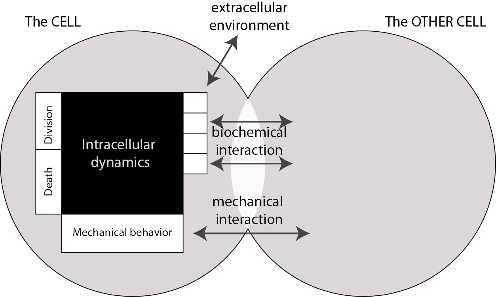
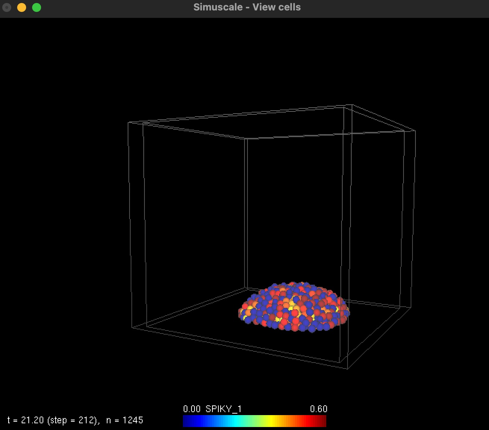

Neuroblastoma
==============

Video links available on OSF

Cell motion:

Mobile: https://osf.io/25cy4/files/umx85

Motile: https://osf.io/25cy4/files/tz3xj

Signalling diffusion with movement "Mobile": https://osf.io/25cy4/files/pzjgv


Guide to run Simuscale for the Neuroblastoma project and reproduce Figures 4, 5, and 6
==============

Figures 4 and 5 show signaling via cell-cell contact (without diffusion), while Figure 6 corresponds 
to the diffusion case, implemented using the files `Cancer_No_Diffusion.cpp`, `Cancer_No_Diffusion.h` 
and `Cancer_Diffusion.cpp`, `Cancer_Diffusion.h`, respectively.

Input files include `param.in`, `kineticsparam.txt` and `GeneInteractionsMatrix.txt`. 

In `param.in`, the simulation parameters are defined as follows. More general information is provided 
in the [Running the simulations](#Running-the-simulations) section below

- `PRNG_SEED` : random number generator seed

- `MAXTIME` : simulation time limit

- `MAXPOP` : maximum population size (if reached before the time limit); here set to 50,000 cells

- `DT` : simulation time step

- `ADD_POPULATION` : used to initialize the cell population, for example `"15 STEM CANCER MOBILE 10 1.0"` 
corresponds to 15 stem cells, cell type: cancer, movement type: mobile, time to reach double cell size: 10 hours,
minimum cell volume: 1

- `WORLDSIZE` : simulation domain size; here set to 80 x 80 x80

Some output information (implemented in the `get_output` function within `Cancer_No_Diffusion.cpp` or 
`Cancer_Diffusion.cpp`) can be accessed in the `# Output parameters` section:

- `CANCER_TYPE` : equals 1 for stem cells and 0 for differentiated cells

- `STEM_CONTACT` : number of neighboring stem cells in contact with the stem cell; equals 0 for differentiated cells

- `SYP_CONTACT` : number of neighboring differentiated cells in contact with the differentiated cell; 
equals 0 for stem cells

- `S2 DIFFUSIVE 2 EPSILON 1e-2` : diffusive signaling from stem cells of type S2, with a reachable area delta = 2 and 
an error tolerance of 0.01 (in the diffusion case, this `SIGNAL` must not be commented with #)

- `VOLUME` : cell volume

- `REMEMBER_DIVISION` : greater than 0 if the cell is currently dividing

- `CANCER_S`, `CANCER_D1`, `CANCER_P` : protein levels of the genes CD133, SYP and Cyclin E, respectively

- `CANCER_mRNA_S`, `CANCER_mRNA_D1`, `CANCER_mRNA_P` : mRNA levels of the genes CD133, SYP and Cyclin E, respectively.


The file `kineticsparam.txt` contains the kinetic input parameters used in the simulations:

- `d0` : degradation rate of mRNA for all genes, set to 1 in this work.

- `D1_s` : protein degradation rate of the gene CD133 (stem cell marker)

- `d1` : protein degradation rate of the gene SYP (differentiated cell marker)

- `a0`, `a1`, `a2` : default bursting parameters

- `P_Diff`, `P_stem` : protein thresholds used as proliferation conditions for differentiated and stem cells

- `D_stem` : differentiation threshold on CD133 protein level

- `S_stem` : signaling strength for each stem-stem cell contact

- `V_SS` : velocity when stem cells are in contact

- `V_SD` : velocity applied when a stem and a differentiated cell encounter

- `V_D` : velocity of interactions between two differentiated cells
  
- `V_normal` : normal cell velocity when there is no contact with other cells

- `S_diff` : signaling strength for each differentiated-differentiated cell contact.


The file `GeneInteractionsMatrix.txt` includes the interaction matrix between the 3 genes `GeneS`, `GeneD1`, and `GeneP`,
coresponding respectively to CD133, SYP and Cyclin E.


To reproduce Figure 4, use `Cancer_No_Diffusion.cpp`, `Cancer_No_Diffusion.h`, and set the input files with 
the `MOBILE` cell type in `param.in`. The differentiation threshold `D_stem` varies between 0.001 and 0.005 
in `kineticsparam.txt` (Figure 4A). Next, `D_stem` is fixed to 0.003, and the signaling strength `S_stem` 
is varied from 0 to 1.4 with a step size of 0.1 (Figure 4B). Finally, for each value of `D_stem`
varying between 0.001 and 0.005, run simulations with `S_stem` varying from 0.1 to 0.5 (Figures 4C-F)

To reproduce Figure 5, use the `MOTILE` movement type in `param.in`.
The velocities `V_SS = V_D` are varied from 0 to 1.024 with a step size of 0.004.
For each case, `V_SD` is varied from 0 to 1.024 (Figures 5A–D).
Next, `V_SD` and `V_D` are set equal, while `V_SS` differs.
All velocities are varied between 0 and 0.256 (Figures 5E–H).


To reproduce Figure 6, use `Cancer_Diffusion.cpp`, `Cancer_Diffusion.h`, and set the `MOTILE` movement type,
the reachable area delta is varied from 1 to 2.5 in `param.in`.
Next, `D_stem` is fixed to 0.004 in `kineticsparam.txt` (Figures 6A-D)  


Guide to Creating Figures 6A–D
============== 

Since running simulations in Simuscale in parallel is not yet available, the simulations must be 
performed manually by creating multiple folders and using MPI to run the jobs.

First, copy the file `Launch_cancer1.py` and the five input files `param_diffusive_1_1to5.in`
(which use the same reachable area delta = 1, but different random seeds) outside
the Neuroblastoma folder. Then run:

	python Launch_cancer1.py

Five new folders corresponding to the reachable area delta = 1 will be created.
For other values of delta, repeat the same procedure.
 

Next, run the newly created Slurm batch script `mega_batch_type_K1.sh` using:

	./mega_batch_type_K1.sh

Five Slurm jobs are submitted. After the simulations have completed, you will receive an email notification 
(note: replace the email address in the Python script with your own).

To calculate the four statistical indices, copy the files `Launch_R_data1.py` and `index.R` to the same
directory as the previous files (outside the Neuroblastoma folder). Then run:

	python Launch_R_data1.py

The file `index.R` is copied into each of the five newly created folders. The indices are then obtained by
submitting the Slurm batch script:
	
	./mega_batch_data1.sh

This procedure is applied to the remaining reachable area values: delta = 1.5, 2, 2.25, and 2.5.

Finally, copy file `plot_index.py` and run

	python plot_index.py

The mean and standard deviation of the four indices are computed, as shown in Figure 6A-D.


Simuscale
============




Install
=========

    mkdir build && cd build
    cmake ..
    make
    sudo make install

TODO: system-dependent install

Create a new cell formalism for Simuscale
==========================================

Write your plugin using the "easy" way, or the hard way described below.

## Write your plugin the easy way

First `cd` into the `src/plugins/` directory

    cd src/plugins/

Copy the boilerplate files `Cell_Boilerplate.h` and `Cell_Boilerplate.cpp` into,
e.g., `Cell_XXX.h` and `Cell_XXX.cpp` for your `XXX` plugin. The name `XXX` of the plugin
should be unique (TODO: where to see the list of existing plugins?).
In our example, we will create a `Spiky` cell plugin: `Cell_Spiky.h` and `Cell_Spiky.cpp`.

In each file, replace all occurrences of `Cell_Boilerplate` by `Cell_Spiky`.

In the file `Cell_Spiky.h`, replace occurrences of
`SIMUSCALE_CELL_BOILERPLATE_H__` by `SIMUSCALE_CELL_XXX_H__`.
Specify the name of the plugin and the classID for your class (attributes `classKW_`
and `classId_`). The attribute `classKW_` must contains the name of the plugin: 

    static constexpr char classKW_[] = "Spiky";

The attribute  `classID_` must be a unique `constexpr`. It can be generated from a CRC32_hash,
with the shell command

    crc32 Cell_Spiky.h

This will generate a unique CRC32 hexadecimal hash. For example, if the hash is `5d861934`, 
the classID will be defined as

    static constexpr CellFormalism classId_ = 0x5d861934; // CRC32 Hash

Look for the `<TODO>` tags and insert your specific code there. The main steps are 
described in the Section below

Default cell methods
=======================

Plugins come with a common set of default constructors, attributes and methods. Constructors and 
methods should be updated to take into account the particular implementation of the 
plugin. 

## Constructors

This constructs a new cell from scratch using constitutive elements and values

    Cell_Boilerplate::Cell_Boilerplate(CellType cellType,
                       const MoveBehaviour& move_behaviour,
                       const Coordinates<double>& pos,
                       double initial_volume,
                       double volume_min,
                       double doubling_time) :
        Cell(cellType, move_behaviour,
             pos, CellSize(initial_volume, volume_min),
             doubling_time) {
    }

There is no need to modify the constructor apart from replacing `Boilerplate` with the name of your plugin.

## Cell Boilerplate methods. 

All these methods should be edited in `Cell_Spiky.cpp`.

`void Cell_Boilerplate::InternalUpdate(const double& dt)` this is where the cell internal state is updated.
The method takes one argument, the time step `dt`, and advances the internal state of the cell by that amount of time. 
As an example, suppose we have three internal variables `x1_`, `x2_`, and `x3_`. The first variable could be
the time elapsed since the birth of the cell. The second variable could be the intracellular concentration
of a protein and the third variable could be the concentration of an intercellular signal called `SPIKY_1`
(for a complete list of signals
see [src/simuscale-core/InterCellSignal.h.in](src/simuscale-core/InterCellSignal.values.in)). 
You can add new signals in this file as needed.
The method could look like that:

    void Cell_Spiky::InternalUpdate(const double& dt) {
      // Example: Step 1. update the intracellular state.
      // Here, is a a very simple, discrete model. 
      x1_ += dt; // x1_ counts the time since birth
      x3_ = getInSignal(InterCellSignal::SPIKY_1);  // Try to get the signal called SPIKY_1
      x2_ += dt*( production_ - degradation_*x2_) + dt*0.3*x3_/(0.09 + x3_*x3_); // x2_ is a protein with constant production and linear degradation

      // Example: Step 2. Check whether it is dying
      if ( isDying() ) return; // if dying, return immediately, don't go through cycling 

      // Example: Step 3. Update cycling status
      // here we don't update anything

      // Example: Step 4. if cycling, then grow
      if ( isCycling() ) Grow(dt); // Grow is a Cell method

      // Example: Step 5. Division status is managed at simulation level
      // nothing to do here, but complete Cell_Spiky::isDividing()

      // Example: Step 6. Cell death status is managed at simulation level
      // nothing to do here, but complete Cell_Spiky::isDying()

    }


The variables `x1_`, `x2_`, `x3_`, `production_`, and `degradation_` need to be declared in
`Cell_Spiky.h` as protected attributes:


    protected:
     double x1_; // first intracellular variable
     double x2_; // 2nd   intracellular variable
     double x3_; // 3rd   intracellular variable

     static constexpr double max_age_     = 48.0;  // lifespan of a cell
     static constexpr double production_  = 0.1;   // protein production rate
     static constexpr double degradation_ = 1.0;   // protein degradation rate

There is also a `max_age_` attribute that will be used later.

`Cell* Cell_Boilerplate::Divide(void)` Divide the current cell into two cells.
The method creates a new `Cell*` and returns it. The newly created cell is called daughter cell,
while the current cell is called mother cell. 
This is where any modification to the mother cell must be realized.  
In our example, we implement a method `Divide` that creates a daughter cell 
based on the state of the mother cell (`new Cell_Spiky`). Then, the mother and the
daughter cells get physically separated (`SeparateDividingCells`). Finally, 
we reset the age of the mother cell to 0 (`x1_ = 0`), and divide the
concentrations by two.
The daughter cell is returned, and will be added to the list of all cells.


    Cell* Cell_Spiky::Divide(void) {
      // Create a copy of the cell with no mechanical forces nor chemical stimuli
      // applied to it
      Cell_Spiky* newCell = new Cell_Spiky(*this);

      // Move cells so they do not have the same center
      SeparateDividingCells(this, newCell);

      x1_ = 0;  // reset the age of the cell to 0
      x2_ /= 2.0;   // x2_: intracellular protein concentration - divide by two
      x3_ /= /2.0;   // x3_: intercellular signal - divide by two
      
      return newCell;
    }

The daughter cell is created from something like a copy constructor:

    Cell_Spiky::Cell_Spiky(const Cell_Spiky &model):
      Cell(model) {
      x1_ = 0.0;             // x1_: cell age, reset to zero
      x2_ = model.x2_/2.0;   // x2_: intracellular protein concentration - divide by two
      x3_ = model.x3_/2.0;   // x3_: intercellular signal - divide by two
    }


`double Cell_Boilerplate::get_output(InterCellSignal signal) const ` 
returns the level of `signal` expressed by the current cell. 
Here we will assume that the signal `SPIKY_1` is expressed by our cells, with 
and expression level equal to the intracellular protein `x2_`.
During the simulations, neighbouring cells will have access to the expression
of `SPIKY_1`. 
In our example, this is the only intercellular signal expressed by our cells, but 
neighbouring cells may request access to other signals. The `get_output` methods
must therefore return a value for any signal listed in the file 
[src/simuscale-core/InterCellSignal.values.in](src/simuscale-core/InterCellSignal.values.in).
The code below returns `x2_` if the signal is `SPIKY_1`, and 0.0 for any other signal. 
Note that in terms of modelling, the expression of a signal has no impact on
intracellular concentration, `x2_` is not modified as a result of being used 
in the expression of `SPIKY_1`.

    double Cell_Spiky::get_output(InterCellSignal signal) const {
      if ( signal == InterCellSignal::SPIKY_1 )
        return x2_;
      else
        return 0.0;
    }

`bool Cell_Boilerplate::isCycling() const` 
is true if the current cell is in the cell cycle.
In our example, we assume that cells are always cycling, but more complex 
decisions could be made based on the intracellular state of the cell, or on
incoming signals.

    bool Cell_Spiky::isCycling() const {
      return true; // cell is always cycling
    }

`bool Cell_Boilerplate::isDividing() const` 
is true if the current cell should divide.

    bool Cell_Spiky::isDividing() const {
      // Should the cell divide now?
      if ( isCycling()       // is the cell in cell cycle?
          && ( x1_ > 24 )    // x1_: age of cell. Is it more than 24h since last division?
          && ( x2_ > 0.12 )  // x2_: is protein concentration large enough?
          ) 
      {
        return true;         // then divide
      }
      else
        return false;        // keep growing
    }


`bool Cell_Boilerplate::isDying() const` 
is true if cell should die  

    bool Cell_Spiky::isDying() const {
      // Should the cell die now?
      if ( x1_ > max_age_ ) {
        return true;         // cell dies if older that max_age_
      }
      else
        return false;
    }

`Coordinates<double> Cell_Spiky::MotileDisplacement(const double& dt)` 
returns the net displacement due to cell motility. This method is called only
when movement behaviour is set to `MOTILE`. In our example, we add a stochastic
movement to our cells, as well as a downward movement in the z-direction.

```
Coordinates<double> Cell_Spiky::MotileDisplacement(const double& dt) {
   // <TODO> Motile cell autonomous displacement behaviour
   size_t nbr_neighbours = neighbours().size();
   double sigma_t = ( nbr_neighbours == 0 )*sigma_ + ( nbr_neighbours > 0 )*si
 gma_/10.0;
   Coordinates<double> displ { sqrt(dt)*sigma_t*Alea::gaussian_random(),
                               sqrt(dt)*sigma_t*Alea::gaussian_random(),
                               sqrt(dt)*sigma_t*Alea::gaussian_random() - dt*0
 .2 };
   return displ;

 }
```

The next five methods are not used here.

`void Cell_Boilerplate::UpdateCyclingStatus()` performs operations related to cycling. TODO: not useful, could be removed  

`bool Cell_Boilerplate::StopCycling()` Conditions for setting cycling status to FALSE.

`bool Cell_Boilerplate::StartCycling()` Conditions for setting cycling status to TRUE.  

`void Cell_Boilerplate::Save(gzFile backup_file) const` backup to `backup_file`  

`void Cell_Boilerplate::Load(gzFile backup_file)` load from `backup_file`

User-defined methods can be added. 

## Cell methods 

Cell methods are part of the simulation core, and as such cannot be modified.
However they can be called from within the current cell.

`void Cell::SeparateDividingCells(Cell* oldCell, Cell* newCell)` 
Used in `Divide()` to move the centers of each dividing cells away.

`double Cell::getInSignal(InterCellSignal inSignal)` returns the total expression
level of `Signal` in neighbouring cells.

`void Cell::Grow(const double& dt)` TODO: this method would belong to the Boilerplate. `Grow` updates the cell volume.

## Accessors

`int32_t id() const {return id_;};` returns the id of the cell.

`const Coordinates<double>& pos() const {return pos_;};` 

`double pos_x() const {return pos_.x;};`  

`double pos_y() const {return pos_.y;};`  

`double pos_z() const {return pos_.z;};`  

`const std::vector<Cell*>& neighbours() const {return neighbours_;};` returns a
vector of references to neighbour cells. This can be used to count how many neighbouring
cells there are, for instance.

`const CellType& cell_type() const {return cell_type_;};`  returns the cell type of the 
current cell. Cell types are "tags" that can help for distinguishing between different 
cells in a simulation, but have no effect in the simulations, except for the 
`NICHE` type, which is a special type that does not move or get updated.
Cell types are specified in the file [src/simuscale-core/CellType.values.in](src/simuscale-core/CellType.values.in).

`double outer_volume() const {return size_.volume();};` Cells are modelled as
soft balls: a incompressible core surrounded by a visco-elastic shell. The `outer_volume`
is the volume including the core and the shell.

`double internal_radius() const {return size_.internal_radius();};`  is the radius 
of the core.

`double external_radius() const {return size_.external_radius();};`  is the
radius of the shell.

Default Cell attributes
==========================

Most default cell attributes have accessors, which should be used instead of the attributes themselves.

`static constexpr CellFormalism classId_` Unique cell formalism identifier   

`static constexpr char classKW_[]` Name of the cell formalism   

`static uint32_t maxID_;`  

`int32_t id_;`  

`Coordinates<double> pos_;`  

`CellSize size_;`  

`CellType cell_type_;`  

`double doubling_time_;`  

`double growth_factor_;`  

`const MoveBehaviour* move_behaviour_`  

`Coordinates<double> mechanical_force_;`  

`bool isCycling_;`  

`std::vector<Cell*> neighbours_;`  

`InterCellSignals intrinsic_inputs_;`  

Default Cell Behaviour
==================================

The class `Cell` implements a number of default behaviours. 

*Growth* The `Grow` method allows the cell to grow in volume. This is useful
for maintaining an average cell volume in dividing cells.

*Dividing Cells* Because cells are spherical, two 
new divided cells do not occupy the same space as the mother cell.
The `SeparateDividingCells` method separates newly divided 
cells along the axis of least mechanical resistance. 

Cell Movement Behaviour
==================================

There are three Movement Behaviour types: `IMMOBILE`, `MOBILE`, and `MOTILE`.
`IMMOBILE` cells cannot move. `MOBILE` cells do not move on their own, but can move
due to mechanical forces from other cells. `MOTILE` cells move according to the plugin
method `MotileDisplacement`. `MOBILE` cells move according to forces induced by 
a Lennard-Jones potential: cells tend to stick together when in contact, but
are pushed away when the cores stars overlapping. Numerical stability issues prevent
the cores from being absolutely incompressible.

Adding the plugin to Simuscale
==================================

Once the plugin files `Cell_Sikpy.cpp` and `Cell_Spiky.h` are implemented, edit the file
`src/CMakeLists.txt` and look for the lines 


    # ============================================================================
    # List all available plugins
    # ============================================================================
    set(PLUGINS Cell_SyncClock Lymphocyte )

Add your new plugin to the list:

    set(PLUGINS Cell_Spiky Cell_SyncClock Lymphocyte )

Installing
================


Simuscale relies on the GNU Scientific Library (GSL) for a number of processes. You will have to install
the GSL before compiling simuscale. On Mac OSX, assuming that the package manager homebrew is installed,
just run 

```
brew install gsl
```

On Ubuntu, use

```
sudo apt-get install libgsl-dev
```

Other Linux distributions might use other package managers, but the installation step will
be similar.

To compile and install `simuscale`, move to the folder `simuscale`, 
and execute the following commands

```
mkdir build && cd build
cmake ..
make
```

The binary files will be located in the folder `simuscale/build/bin/`.
If you have admin rights on your machine, you can install the binary files in your 
local path with

```
sudo make install
```

If you don't have admin rights, if you are installing on a distant server for instance,
`make install` won't work. In that case, you can still run the executable files by
calling them from the path `simuscale/build/bin/`.
Two executable files are generated:

- `simuscale` to perform the simulations

- `view` to visualize the simulation results. 

Note that you can build `simuscale` and `view` independently with

```
make simuscale
```

and

```
make view
```

Running the simulations
============================

## Setup 

Before running the simulation move to the simuscale `simuscale/run`. This is where 
you set the parameters for the simulations. There are already a few folders there,
but you can create another one for you new simulations,

```
mkdir new_simulations
mv new_simulations
```

The executable `simuscale` expects a parameter file with name `param.in` to 
be present in the current folder. The parameter file specifies simulation parameters like
the initial number for each cell type. Parameter are specified as keyword/values pairs:
`KEYWORD VALUE1 VALUE2 ...`. The list of keywords and their possible values is shown below. 
This list is likely to grow in the near future.
Line starting with `#` are comments and are ignored by simuscale.

    PRNG_SEED       AUTO | SEED<int>
    WORLDSIZE       X<double> Y<double> Z<double>
    MAXTIME         TFINAL<double>
    DT              TIMESTEP<double>
    BACKUP_DT       BACKUP_TIMESTEP<double>
    NICHE           FORMALISM EXTERNAL_RADIUS
    ADD_POPULATION  NBR<int> CELLTYPE FORMALISM MOVEBEHAVIOUR DOUBLINGTIME<double> MINVOLUME<double>
    R_RATIO         INTERNAL_TO_EXTERNAL_CELL_RADIUS_RATIO<double>
    USECONTACTAREA  <bool>
    SIGNAL          OUTPUT_INTERCELLULAR_SIGNAL<InterCellSignal>

An example of of the content of `param.in` is 

    #########################
    # Simulation parameters
    #########################
    PRNG_SEED          1421746927
    MAXTIME            100.0
    DT                 0.1 
    ADD_POPULATION     50 STEM SPIKY MOTILE 30 1.0
    ADD_POPULATION     40 CANCER SYNC_CLOCK MOBILE 40 1.0
    
    #########################
    # Cell parameters
    #########################
    R_RATIO            0.90
    
    #########################
    # Output parameters
    #########################
    SIGNAL  SPIKY_1 
    SIGNAL  CLOCK
    SIGNAL  DEATH

## Execution

To run the simulations, execute 

```
../../build/bin/simuscale
```

The simulation will create a number of files in the simulation folder: `trajectory.txt`, `normalization.txt` and backup files.
The file `trajectory.txt` contains the simulation results. The file has a header with lines starting
with `!`, `#` or `$`, followed by rows of simulation data. The header might look like

    ! 40.00 40.00 40.00
    # Column headers :
    # 1 : time
    # 2 : number of cells in the population
    # 3 : cell ID
    # 4 : x position
    # 5 : y position
    # 6 : z position
    # 7 : external radius
    # 8 : cell type
    $ 9 = CLOCK
    $ 10 = CYCLE
    $ 11 = SPIKY_1
    $ 12 = DEATH

The first line `! 40.00 40.00 40.00` indicates the size (x,y,z) of the simulation domain.
The next lines are the column names of the simulation data. Columns 1 to 8 always exist and
are the same for all simulations. Columns starting at 9 are the signals specified in the 
file `param.in`. 

The simulation data are organized in a "tall" format:
each row is specific to one cell at one time point. 
This format makes it easy to filter for a subset of cells or time points.

## Visualisation

The auxiliary executable `view` can be used to visualize the simulation. It uses the
openGL utility toolkit `GLUT` to generate a 3D animation of the cells.

To launch the visualization, just execute `view`

```
../../build/bin/view
```

A window should pop up with a running animation of the cells. During the animation, you can press
the space bar to pause/resume the animation. 



Each cell is represented by a coloured sphere. The colour is a mapping from the signal indicated 
in the colour bar legend. You can go through signals with the keys `]` and `[`. 
The colour map is based on the file `normalization.txt`. This file is automatically generated by 
`simuscale`, and contains the maximal and minimal values taken by each signal throughout the simulation.
It can be useful to set different values for the colour bar to improve the colour contrast. 
This can be done during the animation with the keys `h`, `j`, `k`, and `l` (see below).
You can see the complete list of options and commands
with the option `--help`:

    Usage : /../build/bin/view -h
       or : /../build/bin/view [options]

      -h or --help      : Display this screen

    Options (i : integer, d : double, s : string) :

      -f or --file   s  : View the simulation stored in file named s (default: trajectory.txt)
      -s or --speed  d  : Set the playing speed to d, in frames per ms (default: 0.02)
      -i or --signal s  : Set the signal to display (default is column 8 in file)

      -p or --pause     : Launch in pause mode on (resume with space bar)

      -w or --white     : Set white background (for snapshots)

      -c or --colormap v: Set colormap to v (v = jet (default) or spring)

    If an option is not set, the program uses the default value for this parameter.

    While the animation is playing, you can use the following commands:

      left button of the mouse to change the viewpoint,
      right button to zoom in or zoom out,
      R to reset the perspective.
      space bar to pause the animation or to resume.
      j and k keys to decrease or increase max signal scale.
      h and l keys to decrease or increase min signal scale.
      ] and [ keys to switch to next or previous signal.
      n       key to pause at the next timestep.
      b       key to backtrack to the previous timestep.
      s       key to skip over 50 timesteps.
      Press ESC or q to quit.

Write your plugin the hard way (documentation in progress)
=====================================

## Create class Cell_XXX, derived from base class Cell
class Cell_XXX: public Cell

## Generate an id for your new class
This id can be e.g. the CRC32 hash of the file content
In `Cell_XXX.h`:
`static constexpr CellFormalism classId_ = <CRC32_hash>;`
In `Cell_XXX.cpp`:
`constexpr CellFormalism Cell_ODE::classId_;`

## Create 2 factories (factory and loader-factory) for your class
The first factory (`Cell::CellFactory`) will be used to create instances of your
class at initialization time
The second one (`Cell::CellLoader`) will be used to restore saved instances from
a backup file
NOTA: You will most probably need a couple of constructors taking the same list
of parameters as their factory counterpart

## Register your class with its Id, keyword, factory and loader-factory

### Copy the following lines in your class declaration

```
 private:
  /* dummy attribute - allows to register class in Simuscale statically */
  static bool registered_;
```

### Actually register your class

```
bool Cell_ODE::registered_ =
    Cell::RegisterClass(classId_, classKeyWd, factory, loader);
```

### Override pure abstract methods of base class
This is where you actually define the specifics of the formalism you are adding


